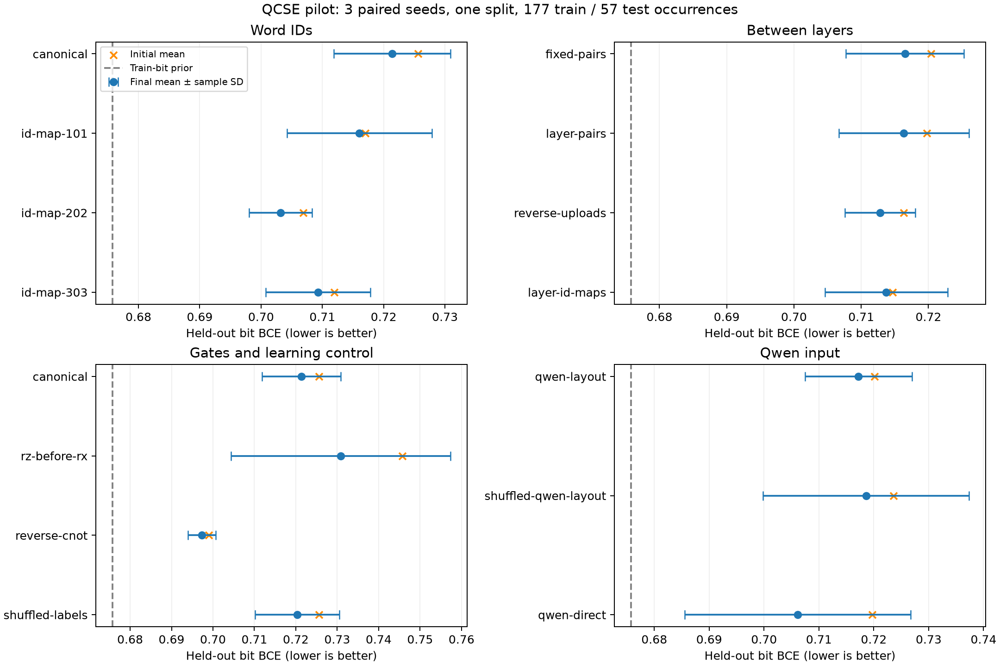

# QCSE audit and bounded experiments — short report

The core implementation follows the paper's equations with documented ambiguities.
It is honest exact simulation, but this pilot does not demonstrate useful quantum
semantic learning. All 57 planned variant runs and the separate 50-epoch audit finished.

- **Metric warning demonstrated:** a constant training-bit prior scored 96.5% on the
  paper's half-bits accuracy in the frequency-ID audit; QCSE had 0% exact-word accuracy.
- **Index/layer/gate order:** numerical behavior changes, often already at initialization.
  Layer-specific shuffles offer negligible benefit; reverse CNOT order lowers BCE but
  still loses to the constant prior. No test-selected winning configuration was adopted.
- **Semantic bits:** Qwen-derived codes beat shuffled codes on neighborhood Hamming
  distance, but alphabetical IDs do slightly better. No named attribute bits were learned.
- **Quantum-state limitation:** a shared terminal unitary cannot change context-state
  fidelities. Nearby binary basis codes are still orthogonal. A separate Ry product
  encoding correctly provides fidelity `(3/4)^Hamming`, without claiming learned advantage.
- **Local Qwen:** all 729 words embedded with the 0.6B model in ~8 s after loading,
  at ~1.9 GiB peak process memory. Layout-only semantics nearly tie shuffled vectors.
  Direct Qwen + classical head achieves 8/57 exact words; every quantum run gets zero.
- **Learning control:** shuffled training labels perform about as well as real labels.
  A larger sweep is premature; first verify reliable context learning and feature retention.

Limits: one tiny sentence-held-out split, three seeds, 26/57 test targets absent from
selected training data, transductive vocabulary, short fixed optimization budget,
external Qwen knowledge, no independent semantic benchmark, and no hardware/noise run.
These are complete pilots, not a reproduction of the paper's accuracy or a convergence claim.

[1. Paper audit](01-paper-audit.md) · [2. Word indices](02-word-index-order.md) ·
[3. Between layers](03-between-layers.md) · [4. Gate order](04-gate-order.md) ·
[5. Semantic bits](05-semantic-bits.md) · [6. Qwen](06-qwen-representations.md) ·
[7. Controls](07-classical-and-negative-controls.md)

[Detailed PROGRESS.md](../PROGRESS.md) · [Raw results](../artifacts/pilot/results.json)
