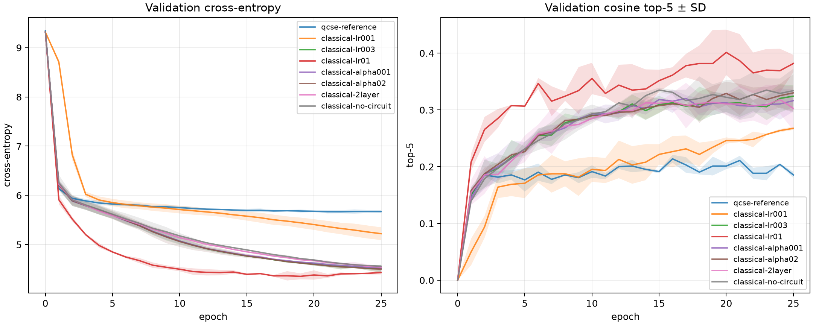
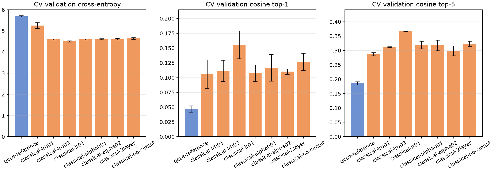

# Quantum attention 25-epoch cross-validation

This report compares fixed QCSE and learned classical input encodings feeding the same causal quantum attention model. An additional classical no-circuit setup uses the learned embeddings and overlap/readout path with the trainable quantum circuits disabled, isolating their contribution. The corpus uses both `phrases` and `cleaned`, balanced sentence sampling, and a shared vocabulary.

The run used 5,000 sentences, 37,867 token examples, 10,864 vocabulary words, 25 epochs per fit, 5,000 replacement draws per epoch, and a 30,331/7,536 development/test example split. Each setup used two independent 20% validation shuffle splits inside development, then a fresh refit on all development examples before one held-out test score.

| Setup | CV validation CE mean ± SD | CV cosine top-1 | CV cosine top-5 | Test CE | Test cosine top-1 | Test cosine top-5 |
| --- | ---: | ---: | ---: | ---: | ---: | ---: |
| qcse-reference | 5.6910 ± 0.0311 | 4.689% | 18.576% | 5.7268 | 4.352% | 18.073% |
| classical-lr001 | 5.2538 ± 0.1376 | 10.602% | 28.688% | 5.1904 | 12.699% | 28.662% |
| classical-lr003 | 4.6028 ± 0.0235 | 11.138% | 31.242% | 4.6084 | 9.939% | 30.480% |
| classical-lr01 | 4.5048 ± 0.0293 | 15.571% | 36.732% | 4.4105 | 17.436% | 38.270% |
| classical-alpha001 | 4.6012 ± 0.0273 | 10.763% | 31.911% | 4.6002 | 10.019% | 30.706% |
| classical-alpha02 | 4.6104 ± 0.0271 | 11.654% | 31.773% | 4.6177 | 9.793% | 30.547% |
| classical-2layer | 4.6085 ± 0.0326 | 11.024% | 29.891% | 4.6209 | 9.740% | 31.303% |
| classical-no-circuit | 4.6414 ± 0.0401 | 12.678% | 32.364% | 4.6504 | 15.035% | 33.718% |

All folds are retained in the CV summaries. Full validation CE by fold (fold 1 / fold 2):
- `qcse-reference`: 5.6690 / 5.7130
- `classical-lr001`: 5.1565 / 5.3511
- `classical-lr003`: 4.5862 / 4.6194
- `classical-lr01`: 4.4841 / 4.5255
- `classical-alpha001`: 4.5819 / 4.6205
- `classical-alpha02`: 4.5912 / 4.6296
- `classical-2layer`: 4.5854 / 4.6316
- `classical-no-circuit`: 4.6131 / 4.6698

The lowest mean validation cross-entropy was `classical-lr01`. Superiority should be judged from the repeated validation mean and spread; the single held-out test score is reported for confirmation and was not used to select a setup.
The matched circuit ablation changes validation CE from 4.6414 ± 0.0401 without the circuit to 4.6028 ± 0.0235 with one quantum layer. Test CE changes from 4.6504 to 4.6084, while no-circuit cosine top-1/top-5 are 15.035%/33.718% versus 9.939%/30.480% with the circuit. The circuit improves cross-entropy here, but does not improve retrieval accuracy; the classical encoder is doing most of the useful work.

The experiment is a statevector simulation of the paper's bilinear attention adaptation. It uses real overlaps, causal masking and normalized postselection; it does not claim finite-shot hardware performance or an efficient block-encoding oracle. The local run used a balanced 5,000-sentence cap so all 1,000 phrase rows were retained alongside cleaned sentences. Omit `--max-sentences` on a GPU allocation to use the full curated pool.

Generated files: `results.json`, per-fold histories/checkpoints, `validation-curves.png`, and `validation-comparison.png`.
